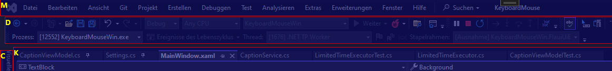

# KeyboardMouse

Use your keyboard to control your computer. This application works only on Windows. The idea comes from the plugin [Vimium C](https://addons.mozilla.org/de/firefox/addon/vimium-c/).

## How to use
1. Press the caption key combination (default CTRL+ALT+W)
2. All user interface elements will get a caption (e.g. "A" or "BC") and a red rectangle around them.
3. Choose the user interface element you want to click by typing in the corresponding caption.
4. If the element has no children, then it will be clicked. Otherwise all child user interface elements will be captioned any you can futher choose the element you want to click.
5. Hold the Shift key while typing in the caption to directly click an element.
6. Hodl the Control key while typing in the caption to double click an element.

Example:

